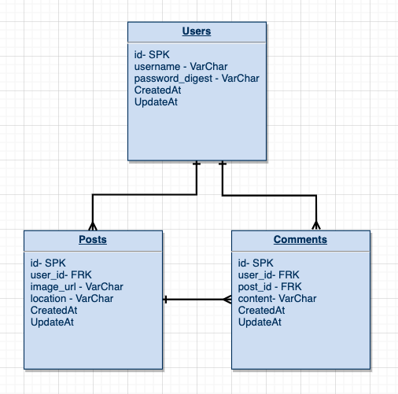

# PROJECT 4 README <!-- omit in toc -->
- [Overview](#overview)
- [MVP](#mvp)
  - [Goals](#goals)
  - [Libraries and Dependencies](#libraries-and-dependencies)
  - [Client (Front End)](#client-front-end)
    - [Wireframes](#wireframes)
    - [Component Tree](#component-tree)
    - [Component Architecture](#component-architecture)
    - [Time Estimates](#time-estimates)
  - [Server (Back End)](#server-back-end)
    - [ERD Model](#erd-model)
- [Post-MVP](#post-mvp)
- [Code Showcase](#code-showcase)
- [Code Issues & Resolutions](#code-issues--resolutions)

<br>

## Overview

_**Around the Globe** is a food blog app where people can upload images of food and add a location to that place(optional) and users can interact with eachother in the comments section._


<br>

## MVP

_The **Around the Globe** MVP are full CRUD for users, responsive design._

<br>

### Goals

- _Lorem ipsum, dolor sit amet,_
- _consectetur adipiscing elit._
- _Phasellus dapibus fermentum risus vitae bibendum._
- _Integer vel ipsum mollis odio sollicitudin ornare eu vel ex._


<br>

### Libraries and Dependencies

|     Library      | Description                                |
| :--------------: | :----------------------------------------- |
|      React       | _._ |
|   React Router   | _._ |
| React SemanticUI | _._ |
|     Express      | _._ |
|  Express Router  | _._ |

<br>

### Client (Front End)

#### Wireframes
Full Wireframes https://www.figma.com/file/sZfl4mMbMqoYORNOQPiLn2/p4?node-id=0%3A1


#### Component Tree

- https://whimsical.com/p4-LKhBVE1bjU15Q6QS2iX4sE


#### Component Architecture

``` structure

src
|__ assets/
      |__ fonts
      |__ graphics
      |__ images
      |__ mockups
|__ components/
      |__ Layout.jsx
      |__ SingInForm.jsx
      |__ SignUpForm.jsx
      |__ CreateForm.jsx
      |__ EditForm.jsx
|__ screens/
      |__ Home.jsx
      |__ Edit.jsx
      |__ Details.jsx
      |__ Create.jsx
      |__ Profile.jsx
      |__ SignUp.jsx
      |__ SignIn.jsx
|__ services/

```

#### Time Estimates


| Task                | Priority | Estimated Time | Time Invested | Actual Time |
| ------------------- | :------: | :------------: | :-----------: | :---------: |
| Creating backend    |    H     |     3 hrs      |     2 hrs     |    3 hrs    |
| Backend seed data   |    H     |     3 hrs      |     1 hrs     |     TBD     |
| Authentication      |    H     |     4 hrs      |     1 hrs     |     TBD     |
| Full CRUD on backend|    H     |     3 hrs      |     1 hrs     |     TBD     |
| Screens             |    H     |     6 hrs      |     1 hrs     |     TBD     |
| Components          |    H     |     4 hrs      |     1 hrs     |     TBD     |
| Full CRUD on frontend|    H    |     4 hrs      |     1 hrs     |     TBD     |
| CSS                 |    H     |     5 hrs      |     1 hrs     |     TBD     |
| Styling forms       |    H     |     6 hrs      |     1 hrs     |     TBD     |
| TOTAL               |          |     38 hrs      |     3 hrs     |     TBD     |


<br>

### Server (Back End)

#### ERD Model

- 
<br>

***

## Post-MVP

> Use this section to document ideas you've had that would be fun (or necessary) for your Post-MVP. This will be helpful when you return to your project after graduation!

***

## Code Showcase

> Use this section to include a brief code snippet of functionality that you are proud of and a brief description.

## Code Issues & Resolutions

> Use this section to list of all major issues encountered and their resolution.